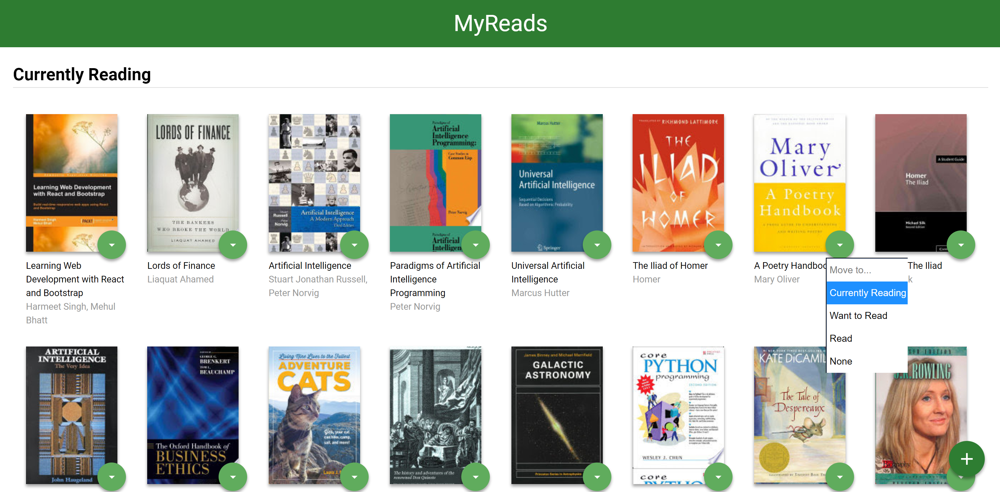
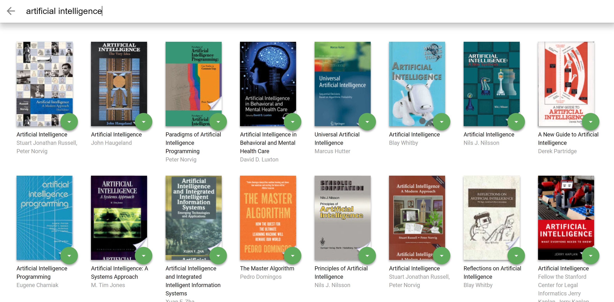

# MyReads

This application keeps track of a user's book selections from a static database on a server. The user may query certain topics (see `SEARCH_TERMS.md`) and then select books from the search results to appear on one of three shelves on the main page: "Currently Reading", "Want To Read", and "Read".

This project is based on a template provided by Udacity's React Fundamentals course, which included a static site employing CSS and HTML. I used React to refactor certain elements of the code and to build out various interactive elements of the site, including:
* a router to navigate between the main page and the search page (using React Router)
* search queries handled via the provided "BooksAPI" with promises
* thumbnail buttons to change the state of both queried and previously-selected books
* state management among components to maintain consistency between information on the main and search pages

Main Page:
<p align="center">
  
</p>

Search Page:
<p align="center">
  
</p>

## Running The Application
To download, you can clone the repository using this terminal command:
```
git clone https://github.com/wbchristerson/reactnd-project-myreads-starter.git
```

Alternatively, follow the instructions below to download to a hard drive:
* Click the green "Clone or download" button above then choose "Download ZIP".
* Find the folder `reactnd-project-myreads-starter` in your Downloads folder or wherever it was placed on your device.
* Right click and choose "Extract All".

To run the application, you will need to have `npm` installed. See [here](https://www.npmjs.com/get-npm) for installation information. Upon downloading both `npm` and the project directory, install all project dependencies by running the command `npm install` from the project directory. Afterwards, start the development server with the command `npm start`.

## Important
The backend API uses a fixed set of cached search results and is limited to a particular set of search terms, which can be found in [SEARCH_TERMS.md](SEARCH_TERMS.md). That list of terms are the _only_ terms that will work with the backend. Other searches will not yield valid results.

## Create React App

This project was bootstrapped with [Create React App](https://github.com/facebookincubator/create-react-app). You can find more information on how to perform common tasks [here](https://github.com/facebookincubator/create-react-app/blob/master/packages/react-scripts/template/README.md).
